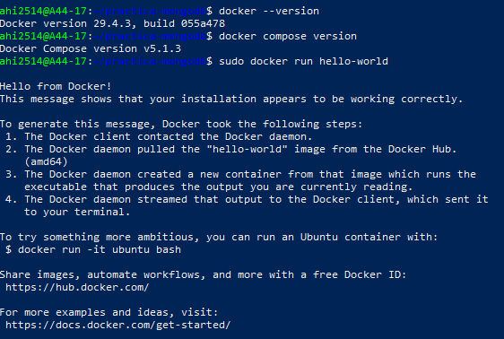
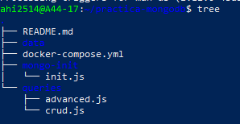
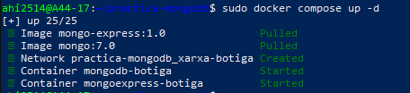
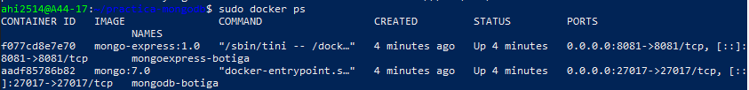
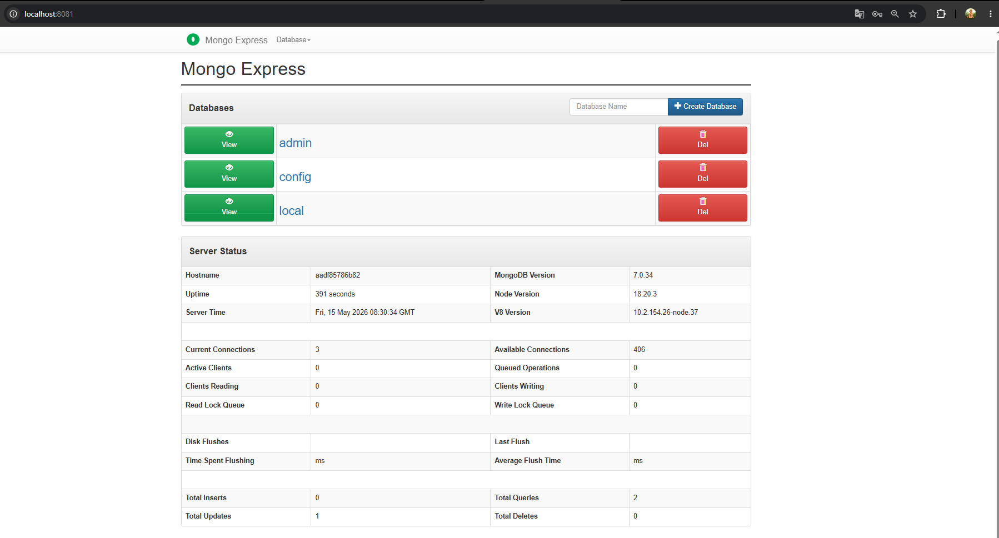

# Seguiment de la Pràctica 1.5 - Docker i MongoDB

**Nom de l'alumne:** [Adrian Higuera]
**Data:** 15-05-2026

## Bloc 0 – Preparació de l’entorn i documentació

### 1. Verificació de l'entorn de treball
S'ha comprovat el correcte funcionament de Docker, Docker Compose i Git al terminal local.

**Captura de pantalla 1: Verificació de versions i Hello World**
>Captura de Verificació

---

### 2. Creació de l'estructura del projecte
S'ha creat l'arbre de directoris i els fitxers base segons les especificacions de la pràctica per garantir un entorn organitzat.

**Captura de pantalla 2: Estructura de fitxers al VS Code**
>Captura de l'Estructura

---

## Bloc 1 – Configuració Docker Compose

### 1.2 Preguntes teòriques

**1. Quina és la diferència entre `docker run` i `docker compose up`?**
*   **`docker run`**: Serveix per aixecar contenidors d'un en un. Has d'escriure tota la configuració manualment cada vegada a la terminal.
*   **`docker compose up`**: Serveix per aixecar diversos contenidors alhora. Tota la configuració es llegeix d'un fitxer (`docker-compose.yml`), cosa que facilita la gestió i evita errors.

**2. Per a què serveix la instrucció `depends_on`? Garanteix que el servei estigui completament operatiu?**
*   Serveix per definir l'**ordre d'arrencada**. Per exemple, diu que la web no s'engegui fins que la base de dades hagi començat a carregar.
*   **No ho garanteix**: Només indica que el contenidor s'ha iniciat. La base de dades pot trigar uns segons extres a estar "llesta" per rebre dades, encara que el contenidor ja estigui actiu.

**3. Diferència entre xarxa bridge per defecte i xarxa personalitzada.**
*   **Bridge per defecte**: Els contenidors estan aïllats i només es parlen si coneixes la seva IP (que és variable).
*   **Xarxa personalitzada**: Permet que els contenidors es trobin pel seu **nom** (com `mongodb-botiga`). Docker gestiona la connexió automàticament sense haver de saber la IP.

---

### Captures del Bloc 1

**Captura de pantalla 3: docker compose up -d**
> Captura de la terminal després d'executar.

**Captura de pantalla 4: Contenidors en execució (docker ps)**
> Captura de la terminal després d'executar `docker ps`.

**Captura de pantalla 5: Interfície Web Mongo Express**
> Captura del navegador a http://localhost:8081.

